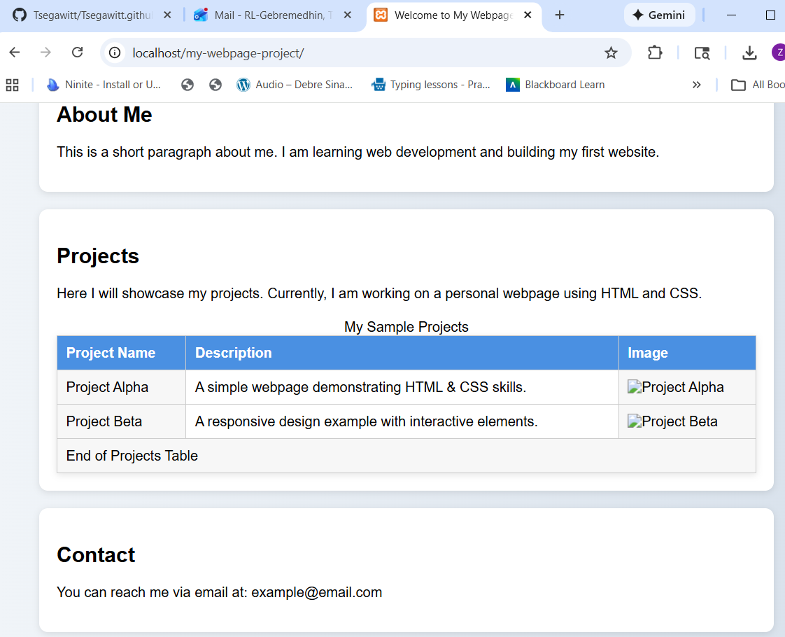

# My Personal Webpage Project

## Project Overview
This project is a fully responsive personal website built using **HTML5, CSS3, and JavaScript**. It includes:
- Home page (`index.html`) with About, Projects, and Contact sections.
- Projects table with images, captions, and hover effects.
- Contact page (`contact.html`) with a fully functional form using Flexbox and JS interactivity.
- Responsive design for mobile, tablet, and desktop using CSS media queries.

## GitHub Repository
[View the repository](https://github.com/tsegawitt/)

## Live Site via GitHub Pages
[View the live website](https://tsegawitt.github.io/)

## Local Hosting Using XAMPP
To view this website locally:
1. Install XAMPP on your computer.
2. Copy the project folder into `C:\xampp\htdocs\`.
3. Start Apache from the XAMPP Control Panel.
4. Open your browser and navigate to: `http://localhost/<project-folder-name>/`

### Screenshot of Local Hosting

## AI Assistant Chat
[Link to AI Assistant chat used for this project]
